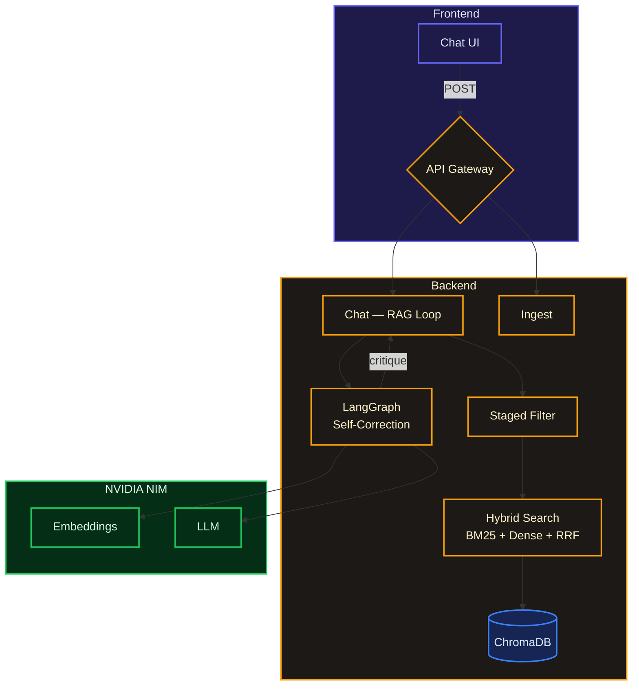

# Suze — Secure Agentic RAG Knowledge Assistant

>Secure Agentic RAG Knowledge Assistant. Chat with your documents using hybrid search and a self-correcting LLM loop.

## What it does

Upload PDFs, Markdown, or text files. Ask questions in natural language. Suze retrieves the most relevant chunks, runs them through a 3-stage filter (metadata → semantic → refinement), and generates grounded answers with automatic critique and reformulation if the first pass isn't good enough.


## Architecture



## Tech Stack

| Layer | Technology |
|-------|-----------|
| Frontend | React 18 + TypeScript + Vite + Tailwind CSS v4 |
| Backend | Python 3.11 + FastAPI |
| Vector DB | ChromaDB (NVIDIA NIM embeddings) |
| LLM | NVIDIA NIM |
| Agent | LangGraph (self-correcting critique loop) |
| Search | Hybrid BM25 + Dense + RRF |
| Auth/Guard | 3-stage metadata pre-filtering |

## Key Features

### 1. Staged Hybrid Filtering (3-Stage)
- **Stage 1 (Pre-filter):** Hard metadata filters (date, access_level, doc_type) shrink search space before vector math
- **Stage 2 (ANN):** Semantic vector search on the pre-filtered subset
- **Stage 3 (Post-filter):** Lightweight refinement (author, tags)

### 2. Agentic Self-Correction Loop
- **Retrieve → Generate → Critique → (Reformulate/Retry/Fallback)**
- LangGraph state machine with MemorySaver checkpointing
- Up to 3 automatic reformulations before safe fallback

### 3. Data Ingestion
- PDF, Markdown, and plain text support
- Semantic-aware chunking (paragraph/sentence boundaries)
- Automatic metadata extraction (date, source, doc_type, tags)

## Project Structure

```text
Suze/
├── backend/
│   ├── src/
│   │   ├── agent/           # LangGraph state, nodes, graph
│   │   ├── api/             # FastAPI routes & models
│   │   ├── ingestion/       # Chunking & extraction pipeline
│   │   ├── retrieval/       # Vector store, hybrid search, staged filter
│   │   ├── config.py        # Pydantic settings
│   │   ├── nvidia_embed.py  # NVIDIA NIM embedding function
│   │   └── main.py          # FastAPI app entry
│   ├── tests/               # 43 tests
│   ├── pyproject.toml
│   └── .env.example
├── frontend/
│   ├── src/
│   │   ├── components/
│   │   │   ├── ui/
│   │   │   │   └── vortex.tsx    # Full-page Aceternity Vortex bg
│   │   │   ├── ChatMessage.tsx
│   │   │   ├── ChatInput.tsx
│   │   │   ├── Sidebar.tsx
│   │   │   └── TypingIndicator.tsx
│   │   ├── lib/
│   │   │   └── utils.ts          # cn() utility
│   │   ├── App.tsx               # Main chat interface
│   │   ├── api.ts                # API client
│   │   ├── types.ts              # TypeScript types
│   │   ├── main.tsx              # Entry point
│   │   └── index.css             # Tailwind + speed-lines
│   ├── package.json
│   ├── vite.config.ts
│   ├── tsconfig.json
│   └── tsconfig.app.json
├── README.md
├── RUN.md
└── .gitignore
```

## API Endpoints

| Method | Path | Description |
|--------|------|-------------|
| POST | `/api/v1/chat` | Ask a question (runs agentic RAG loop) |
| POST | `/api/v1/ingest/text` | Ingest plain text |
| POST | `/api/v1/ingest/file` | Upload PDF/MD/TXT file |
| GET | `/api/v1/health` | Health check with chunk count |
| DELETE | `/api/v1/reset` | Reset vector store |

## Evaluation

The system was built with TDD — **43 automated tests** covering all layers:

| Test Suite | Tests | Scope |
|-----------|-------|-------|
| `test_ingestion.py` | 10 | Chunker, pipeline, metadata extraction |
| `test_retrieval.py` | 18 | Vector store, hybrid search, staged filter |
| `test_agent.py` | 8 | State, router, graph compilation, mock cycles |
| `test_api.py` | 7 | Health, ingest, chat, reset, error handling |

## Security

- Metadata-based access control via Stage 1 pre-filter
- Document-level access_level enforcement
- Safe fallback when context is insufficient (anti-hallucination)

## Author

**Vinesh**

Built with ❤️